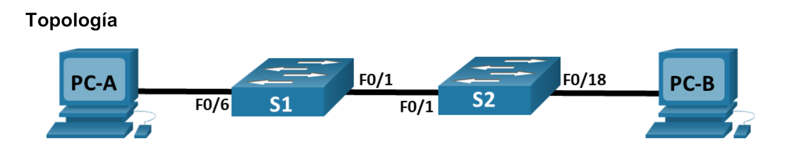

# Lab 3.4.6 configuración Básica

# Parte 1: Armar la red y configurar los ajustes básicos de los dispositivos
En la parte 1, establecerá la topología de la red y configurará los parámetros básicos en los equipos host y
los switches.
### Paso 1: Realizar el cableado de red como se muestra en la topología
Conecte los dispositivos como se muestra en la topología y realizar el cableado necesario.
### Paso 2: Configurar los parámetros básicos para cada switch
* a. Acceda al switch mediante el puerto de consola y habilite al modo EXEC con privilegios.
* b. Ingrese al modo de configuración.
* c. Asigne un nombre de dispositivo al switch.
* d. Inhabilite la búsqueda DNS para evitar que el router intente traducir los comandos mal introducidos como
si fueran nombres de host.
* e. Asigne class como la contraseña cifrada del modo EXEC privilegiado.
* f. Asigne cisco como la contraseña de la consola y habilite el inicio de sesión.
* g. Asigne cisco como la contraseña de vty y habilite el inicio de sesión.
* h. Cifre las contraseñas de texto sin formato.
* i. Cree un aviso que advierta a todo el que acceda al dispositivo que el acceso no autorizado está
prohibido.
* j. Configure la dirección IP que figura en la tabla de direcciones para VLAN 1 en el switch.
* k. Apague todas las interfaces que no se utilizarán.
* l. Ajuste el reloj en el interruptor.
#### PC-A
```swift
Switch>en
Switch#conf t
Switch(config)#hostname S1
S1(config)#enable secret class
S1(config)#line console 0
S1(config-line)#password cisco
S1(config-line)#login
S1(config-line)#exit

S1(config)#line vty 0 4
S1(config-line)#password cisco
S1(config-line)#login
S1(config-line)#exit
S1(config)#service password-encryption 
S1(config)#banner motd $EL acceso no autorizado esta prohibido$
S1(config)#int vlan 1
S1(config-if)#ip address 192.168.1.11 255.255.255.0
S1(config-if)#no sh
S1(config)#int range f0/2-5,f0/7-24,g0/1-2
S1(config-if-range)#sh
S1#clock set 7:37:00 2 May 2023
S1#copy running-config startup-config
```
#### PC-B
```swift
Switch>en
Switch#conf t
Switch(config)#hostname S12
S2(config)#enable secret class
S2(config)#line console 0
S2(config-line)#password cisco
S2(config-line)#login
S2(config-line)#exit

S2(config)#line vty 0 4
S2(config-line)#password cisco
S2(config-line)#login
S2(config-line)#exit
S2(config)#service password-encryption 
S2(config)#banner motd $EL acceso no autorizado esta prohibido$
S2(config)#int vlan 1
S2(config-if)#ip address 192.168.1.12 255.255.255.0
S2(config-if)#no sh
S2(config)#int range f0/2-17, f0/19-24, g0/1-2
S2(config-if-range)#sh
S2#clock set 7:42:00 7 May 2023
S2#copy running-config startup-config
```
### Paso 3: Configurar los equipos host
Consulte la tabla de direccionamiento para obtener información de direcciones de los equipos host.
### Paso 4: Probar la conectividad
Verifique que los equipos host puedan hacer ping entre sí.
**Note**: Puede ser necesario desactivar el firewall de las computadoras para hacer ping entre ellas
* ¿Se puede hacer ping de la PC-A a la PC-B?
	* Si
* ¿Se puede hacer ping de la PC-A al S1?
	* No
* ¿Se puede hacer ping de la PC-B al S2?
	* No
* ¿Se puede hacer ping del S1 al S2?
	* SI
* Si la respuesta a cualquiera de las preguntas anteriores es no, ¿por qué fallaron los pings?
	* Solo en los mismas subredes se puede hacer ping. Para que sea exitoso en las otras subredes debe existir una puerta de enlace predeterminadapara enrutar el tráfico de una subred a otra.
# Parte 2: Crear redes VLAN y asignar puertos de switch
En la parte 2, creará VLAN para los estudiantes, el cuerpo docente y la administración en ambos switches. A
continuación, asignará las VLAN a la interfaz correspondiente. El comando show vlan se usa para verificar
las opciones de configuración.

### Paso 1: Crear las VLAN en los switches
* Crear las Vlans en S1
```
S1(config)#vlan 10
S1(config-vlan)#name Operations
S1(config-vlan)#vlan 20
S1(config-vlan)#name Parking_Lot
S1(config-vlan)#vlan 99
S1(config-vlan)#name Management
S1(config-vlan)#vlan 1000
S1(config-vlan)#name Native
S1(config-vlan)#end

S1#show vlan brief 

VLAN Name                             Status    Ports
---- -------------------------------- --------- -------------------------------
1    default                          active    Fa0/1, Fa0/2, Fa0/3, Fa0/4
                                                Fa0/5, Fa0/6, Fa0/7, Fa0/8
                                                Fa0/9, Fa0/10, Fa0/11, Fa0/12
                                                Fa0/13, Fa0/14, Fa0/15, Fa0/16
                                                Fa0/17, Fa0/18, Fa0/19, Fa0/20
                                                Fa0/21, Fa0/22, Fa0/23, Fa0/24
                                                Gig0/1, Gig0/2
10   Operations                       active    
20   Parking_Lot                      active    
99   Management                       active    
1000 Native                           active    
1002 fddi-default                     active    
1003 token-ring-default               active    
1004 fddinet-default                  active    
1005 trnet-default                    active
```
* Cree las mismas VLAN en el S2
* Ejecute el comando show vlan brief paraver la lista de VLAN en S1.
	* ¿Cuál es la VLAN predeterminada?
		* Vlan 1 la default
	* ¿Qué puertos se asignan a la VLAN predeterminada?
		* Todos los puestos

### Paso 2: Asignar las VLAN a las interfaces del switch correctas
* Asigne las VLAN a las interfaces en el S1.
	1.  Asigne la PC-A a la VLAN Operation.
	```swift
	S1(config)#int f0/6
	S1(config-if)#switchport mo
	S1(config-if)#switchport mode ac
	S1(config-if)#switchport mode access 
	S1(config-if)#switchport access vlan 10
	```
	1. Transfiera la dirección IP del switch a la VLAN 99.
	```swift
	S1(config)#int vlan 1
	S1(config-if)#no ip address 
	S1(config-if)#int vlan 99
	S1(config-if)#ip address 192.168.1.11 255.255.255.0
	S1(config-if)#end
	```* Emita el comando show vlan brief y verifique que las VLAN se hayan asignado a las interfacescorrectas.
```swift
S1#show vlan brief 

VLAN Name                             Status    Ports
---- -------------------------------- --------- -------------------------------
1    default                          active    Fa0/1, Fa0/2, Fa0/3, Fa0/4
                                                Fa0/5, Fa0/7, Fa0/8, Fa0/9
                                                Fa0/10, Fa0/11, Fa0/12, Fa0/13
                                                Fa0/14, Fa0/15, Fa0/16, Fa0/17
                                                Fa0/18, Fa0/19, Fa0/20, Fa0/21
                                                Fa0/22, Fa0/23, Fa0/24, Gig0/1
                                                Gig0/2
10   Operations                       active    Fa0/6
20   Parking_Lot                      active    
99   Management                       active    
1000 Native                           active    
1002 fddi-default                     active    
1003 token-ring-default               active    
1004 fddinet-default                  active    
1005 trnet-default                    active    
S1#
```
* Emita el comando show ip interface brief ¿Cuál es el estado de la VLAN 99? Explique.
	* Su estado es arriba , pero su protocolo esta  a bajo ya que no se le ha asignado un puerto activo
```swift
Interface              IP-Address      OK? Method Status                Protocol 
Vlan99                 192.168.1.11    YES manual up                    down
```
* Asigne PC-B a la VLAN de Operaciones en S2.
```swift
S1(config)#int f0/18
S1(config-if)#switchport mo
S1(config-if)#switchport mode ac
S1(config-if)#switchport mode access 
S1(config-if)#switchport access vlan 10
```
* Elimine la dirección IP para la VLAN 1 en el S2.
* Configure una dirección IP para la VLAN 99 en el S2 según la tabla de direccionamiento.
```swift
S1(config)#int vlan 1
S1(config-if)#no ip address 
S1(config-if)#int vlan 99
S1(config-if)#ip address 192.168.1.12 255.255.255.0
S1(config-if)#end
```
* Use el comando `show vlan brief` para verificar que las VLAN se hayan asignado a las interfacescorrectas.
```swift
S2#show vlan brief 

VLAN Name                             Status    Ports
---- -------------------------------- --------- -------------------------------
1    default                          active    Fa0/1, Fa0/2, Fa0/3, Fa0/4
                                                Fa0/5, Fa0/6, Fa0/7, Fa0/8
                                                Fa0/9, Fa0/10, Fa0/11, Fa0/12
                                                Fa0/13, Fa0/14, Fa0/15, Fa0/16
                                                Fa0/17, Fa0/19, Fa0/20, Fa0/21
                                                Fa0/22, Fa0/23, Fa0/24, Gig0/1
                                                Gig0/2
10   Operations                       active    Fa0/18
20   Parking_Lot                      active    
99   Management                       active    
1000 Native                           active    
1002 fddi-default                     active    
1003 token-ring-default               active    
1004 fddinet-default                  active    
1005 trnet-default                    active 
```

	* ¿Es posible hacer ping del S1 al S2? Explique.
		* No. Las direcciones IP del S1 y el S2 ahora estan asignadas a la VLAN 99 y el tráfico de la VLAN 99 no se enviará a través de la interfaz F0/1.
	* ¿Es posible hacer ping de la PC-A a la PC-B? Explique.
		* No. La interfaz F0/1 no está asignada a la VLAN 10, por lo que el tráfico de la VLAN 10 no se enviará a través de ella
# Parte 3: Mantener las asignaciones de puertos VLAN y la base de datos VLAN
En la parte 3, cambiará las asignaciones de VLAN a los puertos y eliminará las VLAN de la base de datos de VLAN
### Paso 1: Asignar una VLAN a varias interfaces
* En el S1, asigne las interfaces F0/11 a 24 a la VLAN 99.
```swift
S1(config)# interface range f0/11-24
S1(config-if-range)# switchport mode access
S1(config-if-range)# switchport access vlan 99
S1(config-if-range)# end
```
* Ejecute el comando `show vlan brie`f para verificar las asignaciones de VLAN.
```swift
S1#show vlan brief 

VLAN Name                             Status    Ports
---- -------------------------------- --------- -------------------------------
1    default                          active    Fa0/1, Fa0/2, Fa0/3, Fa0/4
                                                Fa0/5, Fa0/7, Fa0/8, Fa0/9
                                                Fa0/10, Gig0/1, Gig0/2
10   Operations                       active    Fa0/6
20   Parking_Lot                      active    
99   Management                       active    Fa0/11, Fa0/12, Fa0/13, Fa0/14
                                                Fa0/15, Fa0/16, Fa0/17, Fa0/18
                                                Fa0/19, Fa0/20, Fa0/21, Fa0/22
                                                Fa0/23, Fa0/24
1000 Native                           active    
1002 fddi-default                     active    
1003 token-ring-default               active    
1004 fddinet-default                  active    
1005 trnet-default                    active 
```
* Reasigne F0/11 y F0/21 a la VLAN 20
```swift
S1(config)#interface range  f0/11-21
S1(config-if-range)#switchport mode access 
S1(config-if-range)#switchport access vlan 20
S1(config-if-range)#show vlan brie
S1(config-if-range)#end
S1#show vlan brief 

VLAN Name                             Status    Ports
---- -------------------------------- --------- -------------------------------
1    default                          active    Fa0/1, Fa0/2, Fa0/3, Fa0/4
                                                Fa0/5, Fa0/7, Fa0/8, Fa0/9
                                                Fa0/10, Gig0/1, Gig0/2
10   Operations                       active    Fa0/6
20   Parking_Lot                      active    Fa0/11, Fa0/12, Fa0/13, Fa0/14
                                                Fa0/15, Fa0/16, Fa0/17, Fa0/18
                                                Fa0/19, Fa0/20, Fa0/21
99   Management                       active    Fa0/22, Fa0/23, Fa0/24
1000 Native                           active    
1002 fddi-default                     active    
1003 token-ring-default               active    
1004 fddinet-default                  active    
1005 trnet-default                    active
```
### Paso 2: Eliminar una asignación de VLAN de una interfaz
* Use el comando no switchport access vlan para eliminar la asignación de la VLAN 10 a F0/24.
* Verifique que se haya realizado el cambio de vlan ¿Con que Vlan esta asociado F0/.24 ahora?\
	* Con la vlan default 1
```swift
S1(config)#interface f0/24
S1(config-if)#no switchport access vlan 
S1(config-if)#end

S1#show vlan br
S1#show vlan brief 

VLAN Name                             Status    Ports
---- -------------------------------- --------- -------------------------------
1    default                          active    Fa0/1, Fa0/2, Fa0/3, Fa0/4
                                                Fa0/5, Fa0/7, Fa0/8, Fa0/9
                                                Fa0/10, Fa0/24, Gig0/1, Gig0/2
10   Operations                       active    Fa0/6
20   Parking_Lot                      active    Fa0/11, Fa0/12, Fa0/13, Fa0/14
                                                Fa0/15, Fa0/16, Fa0/17, Fa0/18
                                                Fa0/19, Fa0/20, Fa0/21
99   Management                       active    Fa0/22, Fa0/23
1000 Native                           active    
1002 fddi-default                     active    
1003 token-ring-default               active    
1004 fddinet-default                  active    
1005 trnet-default                    active 
```
### Paso 3: Eliminar una ID de VLAN de la base de datos de VLAN
* Añadir la interfaz f0/24 a la vlan 30
```swift
S1(config)# interface f0/24
S1(config-if)# switchport access vlan 30
% Access VLAN does not exist. Creating vlan 30
```
* Verificar que la vlan 30 se muestre en la tabla
	* ¿Cuál es el nombre predeterminado de la VLAN 30?
		* VLAN0030
```
VLAN Name                             Status    Ports
---- -------------------------------- --------- -------------------------------
30   VLAN0030                         active    Fa0/24
```
* Use el comando no vlan 30 para eliminar la VLAN 30 de la base de datos de VLAN.
```swift
S1(config)# no vlan 30
S1(config)# end
```
* Emita el comando show vlan brief. F0/24 se asignó a la VLAN 30
* Una vez que se elimina la VLAN 30, ¿a qué VLAN se asigna el puerto F0/24? ¿Qué sucede con el tráfico destinado al host conectado a F0/24?
	* A simple vista con el show vlan br se puede ver que se elimino la vlan 30 y el puerto f0/24 no aparece ya que esta asignada a una vlan que esta borrada en la BD, lo cual a su consecuancia cualquier puerto que este asignado a la vlan 30 no recibira trafico
* Ejecute el comando no switchport access vlan en la interfaz F0/24.
```swift
S1(config)#interface f0/24
S1(config-if)#no switchport access vlan 
```
* ¿A qué VLAN se asignó F0/24?
	* Se vuelve a asignar a la vlan default
* ¿Por qué debe reasignar un puerto a otra VLAN antes de eliminar la VLAN de la base de datos de VLAN?
	* Por lo ya visto, los puertos quedan inactivos por que estan asiganadas a una vlan que ya no existe
# Parte 4: Configurar un enlace troncal 802.1Q entre los switches
En la parte 4, configurará la interfaz F0/1 para que use el protocolo de enlace troncal dinámico (DTP) y permitir que negocie el modo de enlace troncal. Después de lograr y verificar esto, desactivará DTP en la interfaz F0/1 y la configurará manualmente como enlace troncal.

### Paso 1: Usar DTP para iniciar el enlace troncal en F0/1
El modo de DTP predeterminado de un puerto en un switch 2960 es dinámico automático. Esto permite que la interfaz convierta el enlace en un enlace troncal si la interfaz vecina se establece en modo de enlace troncal o dinámico deseado.
* Establezca F0/1 en el S1 en modo de enlace troncal.
```swift
S1(config)# interface f0/1
S1(config-if)# switchport mode dynamic desirable  # el modo sera negociacion dinamica
```
* Emita el comando show vlan brief en el S1 y el S2. La interfaz F0/1 ya no está asignada a la VLAN 1.
Las interfaces de enlace troncal no se incluyen en la tabla de VLAN.
* Emita el comando show interfaces trunk para ver las interfaces de enlace troncal. Observe que el modo
en el S1 está establecido en deseado, y el modo en el S2 en automático.
```swift
S2>show interfaces trunk 
Port        Mode         Encapsulation  Status        Native vlan
Fa0/1       auto         n-802.1q       trunking      1

Port        Vlans allowed on trunk
Fa0/1       1-1005

Port        Vlans allowed and active in management domain
Fa0/1       1,10,20,99,1000

Port        Vlans in spanning tree forwarding state and not pruned
Fa0/1       1,10,20,99,1000

```
```swift
S1#show interfaces trunk 
Port        Mode         Encapsulation  Status        Native vlan
Fa0/1       desirable    n-802.1q       trunking      1

Port        Vlans allowed on trunk
Fa0/1       1-1005

Port        Vlans allowed and active in management domain
Fa0/1       1,10,20,99,1000

Port        Vlans in spanning tree forwarding state and not pruned
Fa0/1       1,10,20,99,1000

```
* Verifique que el tráfico de VLAN se transfiera a través de la interfaz de enlace troncal F0/1.
	* ¿Se puede hacer ping del S1 al S2?
		* Si
	* ¿Se puede hacer ping de la PC-A a la PC-B?
		* Si
	* ¿Se puede hacer ping de la PC-A al S1?
		* No
	* ¿Se puede hacer ping de la PC-B al S2?
		* No
* Si la respuesta a cualquiera de las preguntas anteriores es no, justifíquela a continuación.
	* Porque estan en diferentes vlan
### Paso 2: Configurar manualmente la interfaz de enlace troncal F0/1
El comando switchport mode trunk se usa para configurar un puerto manualmente como enlace troncal. Este comando se debe emitir en ambos extremos del enlace
* Cambie el modo de switchport en la interfaz F0/1 para forzar el enlace troncal. Haga esto en ambos switches.
```swift
S1(config)# interface f0/1
S1(config-if)# switchport mode trunk
```
* Ejecute el comando show interfaces trunk para ver el modo de enlace troncal. Observe que el modo cambió de desirable a on.
```swift
S2# show interfaces trunk
```
* Modifique la configuración troncal en ambos switches cambiando la VLAN nativa de VLAN 1 a VLAN 1000.
```swift
S1(config)# interface f0/1
S1(config-if)# switchport trunk native vlan 1000
```
```swift
S2(config-if)#switchport trunk nat
S2(config-if)#switchport trunk native vlan
S2(config-if)#switchport trunk native vlan 1000
S2(config-if)#
%SPANTREE-2-UNBLOCK_CONSIST_PORT: Unblocking FastEthernet0/1 on VLAN1000. Port consistency restored.

%SPANTREE-2-UNBLOCK_CONSIST_PORT: Unblocking FastEthernet0/1 on VLAN0001. Port consistency restored.
```
* Use el comando show interfaces trunk para verificar la configuración de los enlaces troncales. Observe que se actualiza la información de VLAN nativa.
```swift
S2#show interfaces trunk 
Port        Mode         Encapsulation  Status        Native vlan
Fa0/1       auto         n-802.1q       trunking      1000

Port        Vlans allowed on trunk
Fa0/1       1-1005

Port        Vlans allowed and active in management domain
Fa0/1       1,10,20,99,1000

Port        Vlans in spanning tree forwarding state and not pruned
Fa0/1       1,10,20,99,1000

S2#
```
* ¿Por qué desearía configurar una interfaz en modo de enlace troncal de forma manual en lugar de usar DTP?
	* No todos los equipos utilizan DTP. DTP es propiedad de Cisco y el uso del comando troncal del modo switchport garantiza que el puerto se convertirá en un troncal sin importar qué tipo de equipo esté conectado al otro extremo del enlace.
* ¿Por qué podría querer cambiar la VLAN nativa en un tronco?
	* Por seguridad. Usar la VLAN 1, la VLAN 1, como VLAN nativa, es un riesgo para la seguridad. Todos los diferentes protocolos de control que se intercambian entre conmutadores se intercambian a través de la VLAN 1 nativa sin etiquetar, y esa información podría quedar expuesta si se utilizan configuraciones predeterminadas en los puertos a los que se conectan los usuarios.

### Preguntas de reflexión
1. ¿Qué se necesita para permitir que los hosts en la VLAN 10 se comuniquen con los hosts en la VLAN 99?
	1. Un router (apara capa 3)
2. ¿Cuáles son algunos de los beneficios principales que una organización puede obtener mediante el usoeficaz de las VLAN?
	1. Seguridad, eficiencia en costos, mayor rendimiento

